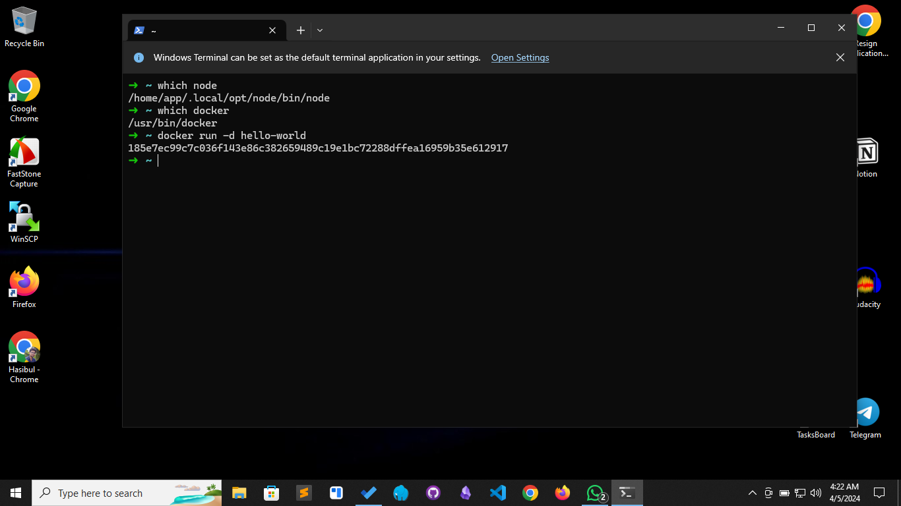

# intro-code


###### Needed Command
```
which node
which docker
docker run -d hello-world
```

###### Output
```

/home/app/.local/opt/node/bin/node
/usr/bin/docker
185e7ec99c7c036f143e86c382659489c19e1bc72288dffea16959b35e612917

```

